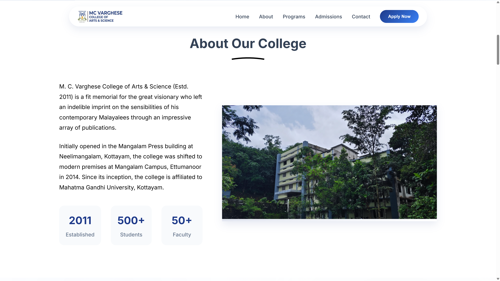
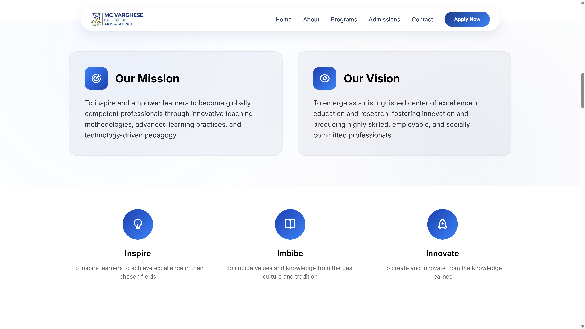
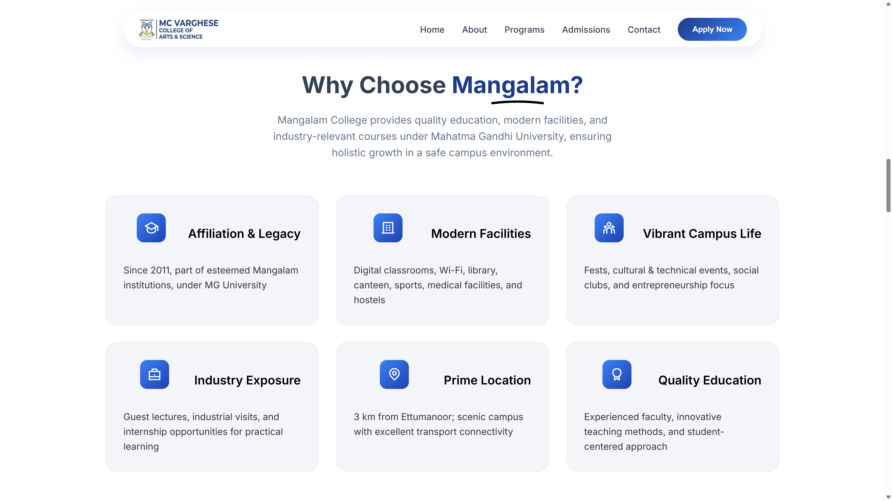
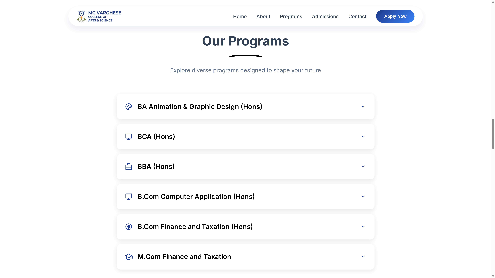
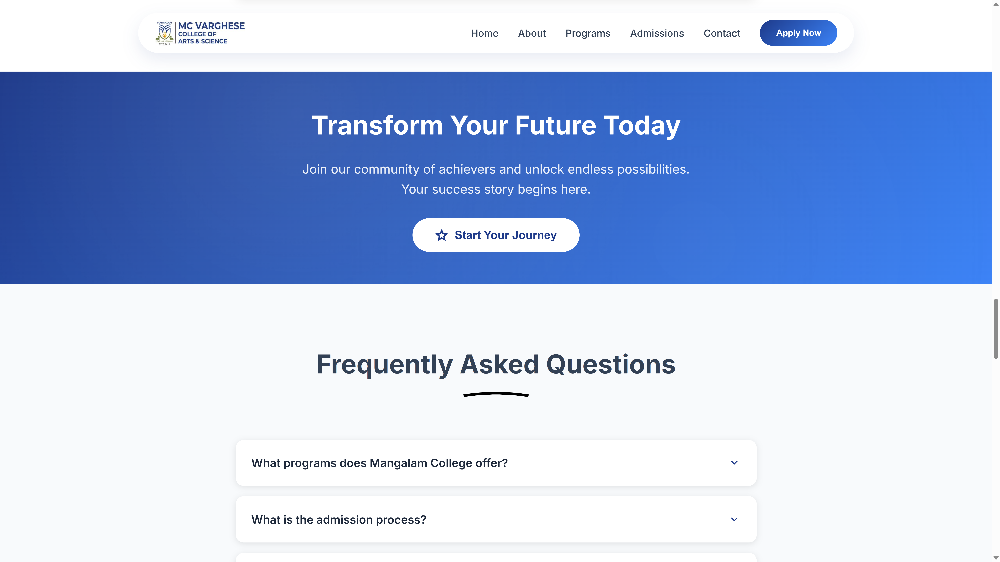
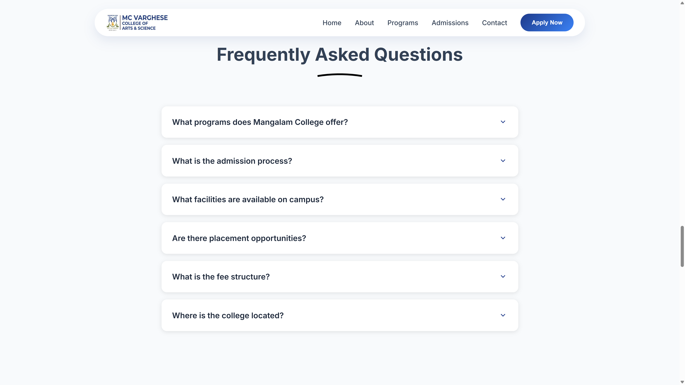
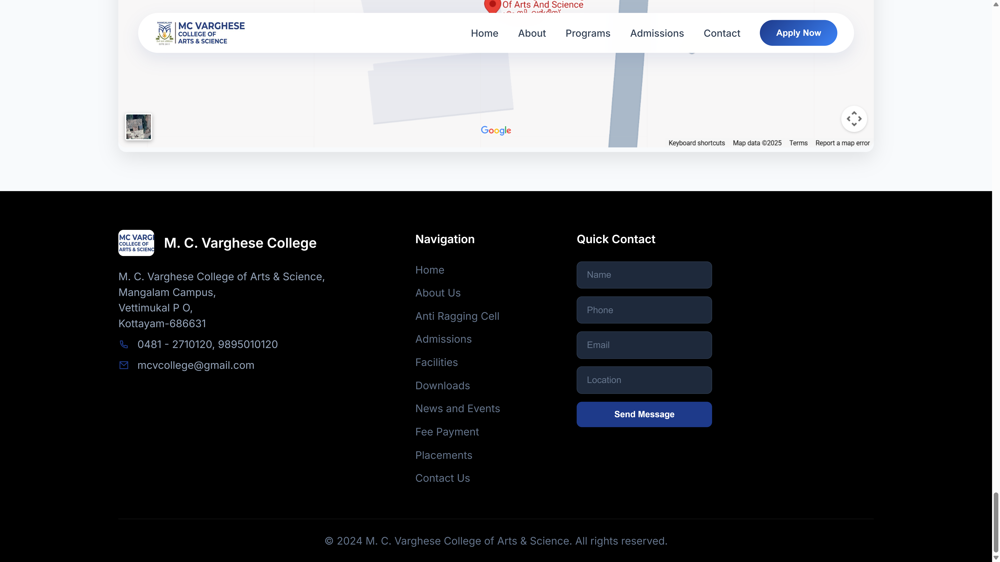

# M. C. Varghese College Website

A modern, responsive college website for M. C. Varghese College of Arts & Science showcasing academic programs, facilities, and admission information. Built with HTML, CSS, and JavaScript featuring interactive sections and mobile-friendly design.

## 🌟 Features

- **Responsive Design**: Optimized for desktop, tablet, and mobile devices
- **Interactive Elements**: Expandable course listings, FAQ accordion, smooth animations
- **Modern UI**: Glass morphism navigation, hover effects, and clean typography
- **Google Maps Integration**: Embedded map showing exact college location
- **Admission Portal**: Direct links to online admission system
- **Contact Information**: Complete contact details with office hours

## 📸 Screenshots

### Hero Section

*Modern hero banner with college statistics and call-to-action buttons*

### About Section

*College history, mission, vision, and key statistics*

### Programs Section

*Interactive expandable course listings with detailed descriptions*

### Why Choose Us

*Key features and benefits of choosing Mangalam College*

### FAQ Section

*Interactive frequently asked questions with clickable answers*

### Contact & Map

*Complete contact information with embedded Google Maps*

### Footer

*Modern footer with navigation links and quick contact form*

### Additional Section

*Complete website overview showing all sections*

## 🚀 Technologies Used

- **HTML5**: Semantic markup and structure
- **CSS3**: Modern styling with flexbox, grid, and animations
- **JavaScript**: Interactive functionality and DOM manipulation
- **Google Maps API**: Location embedding
- **Remix Icons**: Icon library for visual elements
- **Google Fonts**: Inter font family for typography

## 📁 Project Structure

```
college-website/
├── index.html              # Main HTML file
├── style.css               # Main stylesheet
├── script.js               # JavaScript functionality
├── mission-vision.css      # Mission & vision section styles
├── curve-style.css         # Curved underline styles
├── programs.css            # Programs section styles
├── cta-section.css         # Call-to-action section styles
├── faq-section.css         # FAQ section styles
├── footer-modern.css       # Footer styles
├── map-section.css         # Map section styles
├── link-styles.css         # Link styling
├── images/                 # Image assets
│   ├── logo.jpg
│   ├── clg1.jpg
│   ├── clg2.jpg
│   └── FC-1.jpg
└── README.md              # Project documentation
```

## 🎯 Key Sections

### 1. Navigation
- Glass morphism design
- Responsive hamburger menu
- Direct admission portal link

### 2. Hero Section
- College introduction
- Key statistics (500+ Students, 50+ Faculty, 95% Placement)
- Apply Now and Explore Courses buttons

### 3. About Section
- College history since 2011
- Affiliation with Mahatma Gandhi University
- Campus relocation information

### 4. Mission & Vision
- Institutional mission statement
- Vision for excellence in education
- Core values: Inspire, Imbibe, Innovate

### 5. Why Choose Mangalam
- 6 key features highlighting college benefits
- Modern facilities and prime location
- Industry exposure and quality education

### 6. Programs
- Interactive expandable course details
- Undergraduate: BCA, BBA, B.Com (Computer Application & Finance)
- Postgraduate: M.Com Finance and Taxation
- Duration and career path information

### 7. CTA Section
- "Transform Your Future Today" call-to-action
- Direct link to admission portal

### 8. FAQ Section
- Interactive accordion-style questions
- Common queries about programs, admissions, facilities
- Clickable expand/collapse functionality

### 9. Contact Section
- Complete contact information
- Office hours and location details
- Phone numbers and email addresses

### 10. Map Section
- Embedded Google Maps
- Exact college location marker
- "Open in Google Maps" functionality

### 11. Footer
- College information and contact details
- Navigation links
- Quick contact form
- Social media links

## 🛠️ Installation & Setup

1. **Clone the repository**
   ```bash
   git clone https://github.com/VivekOrginal/College-website-.git
   cd College-website-
   ```

2. **Run locally**
   ```bash
   # Using Python HTTP server
   python -m http.server 8000
   
   # Or using Node.js
   npx http-server
   
   # Or simply open index.html in browser
   ```

3. **Access the website**
   - Open `http://localhost:8000` in your browser
   - Or double-click `index.html` file

## 📱 Responsive Design

The website is fully responsive and optimized for:
- **Desktop**: Full-featured layout with hover effects
- **Tablet**: Adapted layout with touch-friendly elements
- **Mobile**: Optimized navigation and content stacking

## 🔗 Live Demo

Visit the live website: [M. C. Varghese College Website](https://vivekorginal.github.io/College-website-)

## 📞 Contact Information

**M. C. Varghese College of Arts & Science**
- **Address**: Mangalam Campus, Vettimukal P O, Kottayam-686631
- **Phone**: 0481 - 2710120, 9895010120
- **Email**: mcvcollege@gmail.com
- **Admission Portal**: [Apply Now](https://www.mcvarghese.com/admission2024.php)

## 🤝 Contributing

1. Fork the repository
2. Create a feature branch (`git checkout -b feature/improvement`)
3. Commit your changes (`git commit -am 'Add new feature'`)
4. Push to the branch (`git push origin feature/improvement`)
5. Create a Pull Request

## 📄 License

This project is licensed under the MIT License - see the [LICENSE](LICENSE) file for details.

## 👨‍💻 Developer

**Vivek**
- GitHub: [@VivekOrginal](https://github.com/VivekOrginal)
- Project: [College Website](https://github.com/VivekOrginal/College-website-)

---

*Built with ❤️ for M. C. Varghese College of Arts & Science*